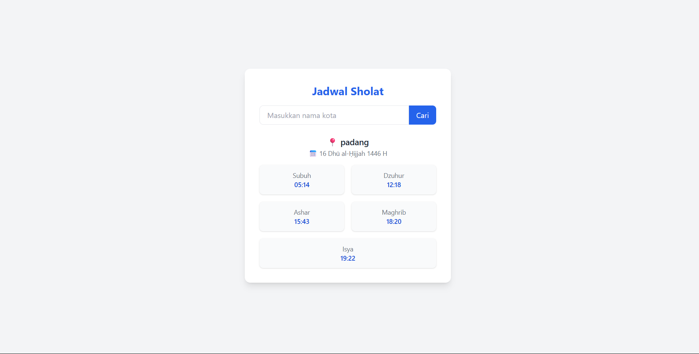

# KALKULATOR

Aplikasi kalkulator sederhana berbasis web menggunakan Python (Flask).

---

## Syarat menjalankan aplikasi lewat terminal:

```bash
python app.py
```
dengan hasil 

# KIRIM PESAN WHATSAPP

Aplikasi Kirim Pesan Whatsapp sederhana berbasis web menggunakan Python (Flask).

---

## Syarat menjalankan aplikasi lewat terminal:

```bash
python app.py
```
dengan hasil 

# TODO LIST JOB

Aplikasi Todo List sederhana berbasis web menggunakan Python (Flask).
Dapat menambahkan, dan menghapus list tugas/ capaian yang di tulis!

---

## Syarat menjalankan aplikasi lewat terminal:

```bash
python app.py
```
dengan hasil 

# KASIR SEDERHANA

Aplikasi Kasir sederhana berbasis web menggunakan Python (Flask).

---

## Syarat menjalankan aplikasi lewat terminal:

```bash
python app.py
```
dengan hasil 


# SHOLAT APP

Aplikasi untuk melihat waktu sholat berdasarkan kota dengan API dari : https://aladhan.com/prayer-times-api , berbasis web menggunakan Python (Flask).

---

## Syarat menjalankan aplikasi lewat terminal:

```bash
python app.py
```
dengan hasil 

# Digit_Ditektor

Aplikasi AI sederhana berbasis GUI menggunakan Python (Flask) yang dapat mendeteksi angka yang di gambar dengan keakuratan 60%.

---

## Syarat menjalankan aplikasi lewat terminal:
### 1 Pastikan Terinstal
```bash
python.exe -m pip install --upgrade pip
```
```bash
pip install numpy matplotlib scikit-learn joblib
```
```bash
pip install -r requirements.txt
```
### 2 Baru Jalankan
```bash
python main.py
```

dengan hasil ! <br>[Alt Text](Digit_Detektor/hasilImage/Digitektor.png)</br>
