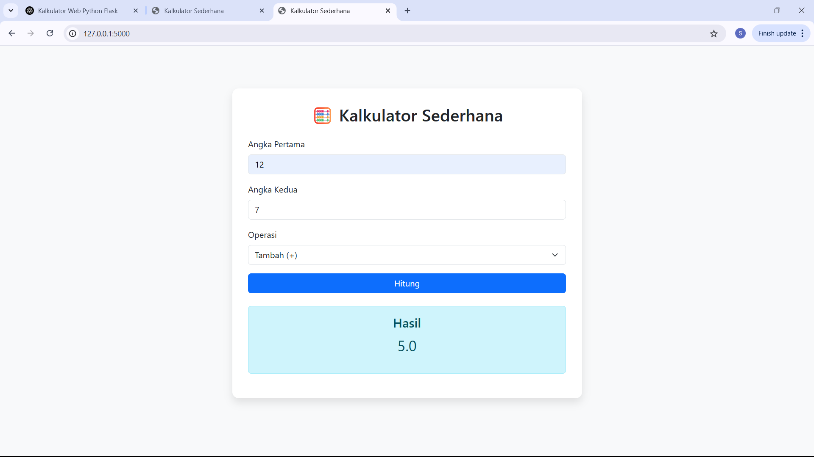
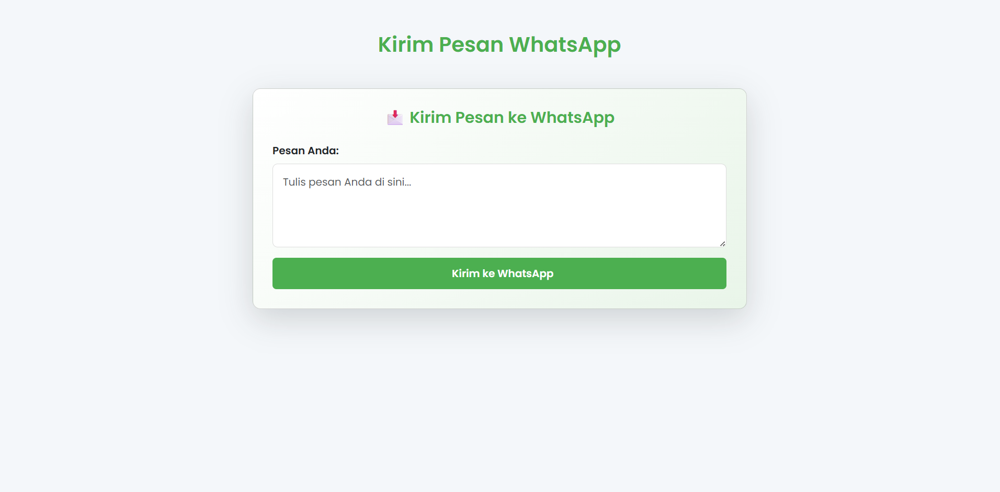
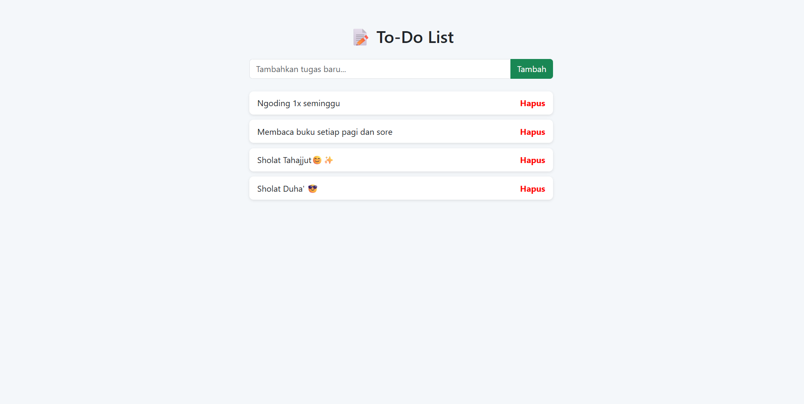
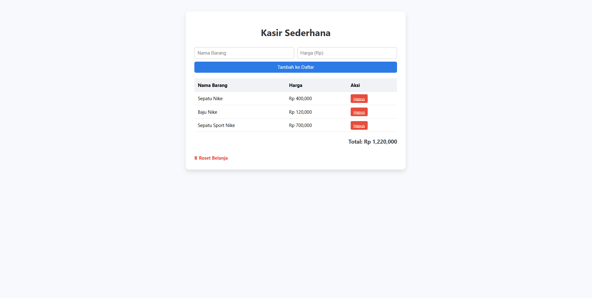

# KALKULATOR

Aplikasi kalkulator sederhana berbasis web menggunakan Python (Flask).

---

## Syarat menjalankan aplikasi lewat terminal:

```bash
python app.py
```
dengan hasil 

# KIRIM PESAN WHATSAPP

Aplikasi Kirim Pesan Whatsapp sederhana berbasis web menggunakan Python (Flask).

---

## Syarat menjalankan aplikasi lewat terminal:

```bash
python app.py
```
dengan hasil 

# TODO LIST JOB

Aplikasi Todo List sederhana berbasis web menggunakan Python (Flask).
Dapat menambahkan, dan menghapus list tugas/ capaian yang di tulis!
---

## Syarat menjalankan aplikasi lewat terminal:

```bash
python app.py
```
dengan hasil 

# KASIR SEDERHANA

Aplikasi Kasir sederhana berbasis web menggunakan Python (Flask).

---

## Syarat menjalankan aplikasi lewat terminal:

```bash
python app.py
```
dengan hasil 
